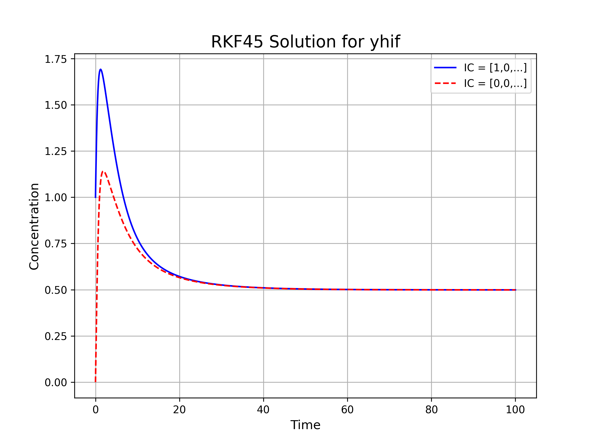

# Simulating the Dynamics of Programmed Cell Death 🧬


This repository contains the source code, analysis scripts, and documentation for the paper **"Simulating the Dynamics of Programmed Cell Death,"** a project focused on the comprehensive evaluation of numerical and machine learning methods for solving an Ordinary Differential Equation (ODE) model of apoptosis.

---

## 📖 Table of Contents
* [Overview](#-overview)
* [The Apoptosis Model](#-the-apoptosis-model)
* [Methods Logic](#-Methods-Logic)
* [Project Structure](#-project-structure)
* [How to Run the Analyses](#-how-to-run-the-analyses)
* [Key Results and Visualizations](#-Simulation-Results-and-Discussion)
* [Future Work](#-Future-Work-and-Improvements)
* [Authors](#-authors)
* [License](#-license)
* [Acknowledgments](#-acknowledgments)

---

## 🔭 Overview

Apoptosis, or programmed cell death, is a fundamental biological process. Its disruption can lead to severe diseases like cancer and neurodegeneration. Mathematical models, particularly systems of ODEs, are essential for understanding the intricate cellular mechanisms that govern this process.

This project dives deep into the core of computational biology by exploring a critical question: **How does the choice of a numerical solver impact the accuracy and efficiency of a biological simulation?**

We implement and compare four distinct solvers to analyze their performance on a well-established six-variable ODE model of apoptosis. The goal is to provide a clear, hands-on benchmark of their accuracy, stability, and computational trade-offs, offering insights for both classical and modern simulation approaches.

---

## 🔬 The Apoptosis Model

The project is based on the six-variable ODE model proposed by Laise et al., which describes the concentration dynamics of key molecular players in the apoptosis pathway:

| Variable | Description                  | Role in Apoptosis             |
| :------- | :--------------------------- | :---------------------------- |
| **HIF-1**  | Hypoxia-inducible factor     | Responds to low oxygen stress |
| **O2**     | Oxygen                       | A critical metabolic component|
| **p300**   | Coactivator protein          | Interacts with HIF-1 and p53  |
| **p53**    | Tumor suppressor protein     | A key regulator of cell fate  |
| **Caspase**| Executioner proteins         | The primary drivers of cell death |
| **K+**     | Potassium ions               | Ion flux is a hallmark of apoptosis |

The full system of six coupled, non-linear ODEs can be found in the accompanying paper. The dynamics capture how these components interact to decide whether a cell lives or dies.

---

## 📂 Project Structure
```
.
├── Graphs/      # Output graphs from the RK4 analysis, RKF45 analysis, Euler analysis and PINN analysis
│
├── Code/      # Script to analyze methods
│
├── Paper/                  # The final PDF paper
├── report.pdf                  # The LaTeX source for the report
│
├── requirements.txt            # Required Python libraries
├── LICENSE                     # MIT License file
└── README.md                   # This file
```
---

## 🚀 How to Run the Analyses

### Prerequisites
- Python 3.7+
- A virtual environment is recommended.
- Install all required Python libraries with a single command:
  ```bash
  pip install -r requirements.txt
  ```

## 🛠️ Methods Logic

### 1. Runge-Kutta-Fehlberg (RKF45) Method ⚙️

#### Logic
The RKF45 is a modern, **adaptive step-size** solver. Its logic is based on the concept of an "embedded" method. At each step, it calculates two solutions simultaneously: a 4th-order estimate and a more accurate 5th-order estimate, using a shared set of function evaluations for efficiency. The difference between these two estimates provides a direct measure of the local error. This error is then used in a feedback loop:
-   If the error is too large, the step is rejected, the step size `h` is reduced, and the step is re-calculated.
-   If the error is acceptable, the step is taken, and `h` may be increased for the next step.
This adaptive control ensures the simulation maintains high accuracy while being computationally efficient.

---

### 2. 4th-Order Runge-Kutta (RK4) Method 📈

#### Logic
The RK4 method is a high-accuracy, fixed-step solver that dramatically improves upon the Euler method. Its core logic involves sampling the slope at **four strategic points** within each time step: the beginning, two different estimates at the midpoint, and the end. By calculating a weighted average of these four slopes, the RK4 method creates a much more accurate projection that effectively accounts for the solution's curvature. Its error decreases much faster with smaller step sizes ($O(h^4)$), making it a workhorse for non-stiff ODE problems.

---

### 3. Explicit Euler Method 📉

#### Logic
The Euler method is the foundational first-order numerical solver. Its logic is based on making a linear approximation at each time step. It calculates the slope (the derivative) at a known point and takes a small step forward along that tangent line to estimate the next point. While simple and computationally fast, its accuracy is low because it completely ignores the curvature of the solution path, leading to an accumulation of error. It is also only conditionally stable, requiring a very small, fixed step size to avoid divergence.

---

### 4. Physics-Informed Neural Network (PINN) 🧠

#### Logic
The PINN represents a complete paradigm shift from traditional numerical methods. It is a machine learning approach that uses a neural network to learn a **continuous function** that approximates the ODE solution. Its logic is not based on discrete time-stepping. Instead, it is trained by minimizing a composite **loss function** that penalizes two things:
1.  **IC Loss:** The network's output at `t=0` must match the known initial conditions.
2.  **Physics Loss:** The network's derivative (calculated via automatic differentiation) must satisfy the governing ODEs at all points.
By forcing the network to obey the laws of physics defined by the equations, the PINN learns the solution trajectory without being given any pre-computed data points.

## 📊 Simulation Results and Discussion

A quantitative analysis was performed to compare the four implemented solvers using the initial condition `y0 = [1,0,0,0,0,0]`. The solutions were evaluated at key time points to observe their behavior during both the transient and steady-state phases.

The results show that all four methods—RKF45, RK4, Euler, and the PINN (ML)—produce very similar solution values for each variable. The close agreement demonstrates that the system is numerically stable and that each method, from the high-precision RKF45 to the data-driven PINN, is capable of accurately capturing the system's dynamics.

### Comparison of Solution Values at Key Time Points

The following table presents the calculated concentrations for each variable at `t = 25, 50, 75, 100`.

| Method | Time | y_hif | y_o2 | y_p300 | y_p53 | y_casp | y_kp |
| :--- | :--- | :--- | :--- | :--- | :--- | :--- | :--- |
| **RKF45** | 25 | 0.5407 | 2.6699 | 0.4732 | 0.4587 | 1.2789 | 0.5693 |
| | 50 | 0.5037 | 2.8410 | 0.5773 | 0.4941 | 1.4711 | 0.5266 |
| | 75 | 0.4996 | 2.8618 | 0.5950 | 0.4968 | 1.4943 | 0.5223 |
| | 100 | 0.4991 | 2.8646 | 0.5978 | 0.4970 | 1.4968 | 0.5219 |
| **RK4** | 25 | 0.5420 | 2.6645 | 0.4706 | 0.4576 | 1.2735 | 0.5706 |
| | 50 | 0.5038 | 2.8407 | 0.5771 | 0.4940 | 1.4708 | 0.5267 |
| | 75 | 0.4996 | 2.8618 | 0.5950 | 0.4968 | 1.4943 | 0.5223 |
| | 100 | 0.4991 | 2.8646 | 0.5978 | 0.4970 | 1.4968 | 0.5219 |
| **Euler** | 25 | 0.5419 | 2.6647 | 0.4707 | 0.4576 | 1.2737 | 0.5705 |
| | 50 | 0.5038 | 2.8408 | 0.5771 | 0.4940 | 1.4709 | 0.5267 |
| | 75 | 0.4996 | 2.8618 | 0.5950 | 0.4968 | 1.4943 | 0.5223 |
| | 100 | 0.4991 | 2.8646 | 0.5978 | 0.4970 | 1.4968 | 0.5219 |
| **PINN (ML)**| 25 | 0.5469 | 2.6449 | 0.4661 | 0.4501 | 1.2718 | 0.5664 |
| | 50 | 0.5081 | 2.8231 | 0.5672 | 0.4841 | 1.4567 | 0.5278 |
| | 75 | 0.4961 | 2.8538 | 0.5916 | 0.4933 | 1.4908 | 0.5188 |
| | 100 | 0.5027 | 2.8491 | 0.4887 | 0.4887 | 1.4878 | 0.5228 |

### Visual Comparison

The following graph shows a direct visual comparison of the solutions produced by each method for the `HIF-1` variable.

|||
|||

---

## 💡 Future Work and Improvements

This project serves as a strong foundation for further exploration into advanced computational techniques for systems biology. Several key areas for future improvements and research are identified:

### 1. Solving the Inverse Problem with PINNs
The most significant area for future work is extending the Physics-Informed Neural Network (PINN) framework to solve the **inverse problem**. 
-   **Challenge:** While this paper focused on the "forward problem" (simulating the system with known parameters), a more impactful challenge is to estimate unknown biological parameters (e.g., the reaction rate constants `a_i`) from sparse and potentially noisy experimental data.
-   **PINN Advantage:** A PINN can be trained to match known data points while simultaneously being constrained by the ODEs. This allows it to deduce the most likely parameter values that fit both the data and the known physics.
-   **Next Step:** A future study could compare a PINN's performance in parameter estimation against traditional optimization methods.

### 2. Development of Hybrid Solvers
An exciting research direction is the creation of **hybrid models** that combine the strengths of traditional numerical solvers and neural networks.
-   **Concept:** A fast numerical solver like RK4 could generate a high-quality initial guess for the solution, which could then be rapidly refined by a PINN. This could dramatically reduce the training time required for the PINN to converge.
-   **Alternative:** A neural network could be used to learn a complex, data-driven term within an ODE that is then integrated into a larger system solved by a traditional method, allowing for models that mix known physics with learned behavior.

### 3. Stochastic and Multi-Scale Modeling
The current ODE model is deterministic, describing the average behavior of many cells. However, biological processes at the single-cell level are inherently stochastic (random).
-   **Improvement:** A future enhancement would be to develop a **Stochastic Differential Equation (SDE)** version of the model.
-   **Benefit:** This would allow for the simulation of cell-to-cell variability and noise, which are often crucial for understanding phenomena like drug resistance or why some cells in a population undergo apoptosis while others survive.

### 4. Model Expansion and Validation
The current six-variable model is a necessary simplification of the true biological complexity.
-   **Next Step:** The model could be **expanded** by incorporating additional key proteins or feedback loops known to be important in the apoptosis pathway (e.g., distinguishing between different caspase types like caspase-8, -9, and -3, or including the Bcl-2 protein family).
-   **Validation:** The expanded model would then need to be rigorously validated by fitting its parameters to new experimental time-course data, making it a more powerful predictive tool.
  
---

## 👥 Authors

-   **Ziad Osama Ismaill**
-   **Anas Mohamed Abdelghany**
-   **Ahmed Mahmoud Adel**
-   **Hassan Badawy Mohamed**
-   **Mohamed Ehab Ahmed**
-   **Menna Atef Eid**
-   **Engy Mohamed Mahmoud**
-   **Nada Mostafa Kamel**
-   **Saga Sadek Zakaria**

All authors are affiliated with the **Faculty of Engineering, Biomedical Department, Cairo University**.

---

## 📜 License

This project is licensed under the **MIT License**. See the [LICENSE](LICENSE) file for details.

---

## 🙏 Acknowledgments

This work is based on the apoptosis model originally proposed by P. Laise, D. Fanelli, and A. Arcangeli in their 2012 paper, "A dynamical model of apoptosis and its role in tumor progression." We thank them for providing a robust and interesting system for our analysis.

## 📞 Contact
Email: anas.bayoumi05@eng-st.cu.edu.eg <br>
LinkedIn: https://www.linkedin.com/in/anas-mohamed-716959313/
